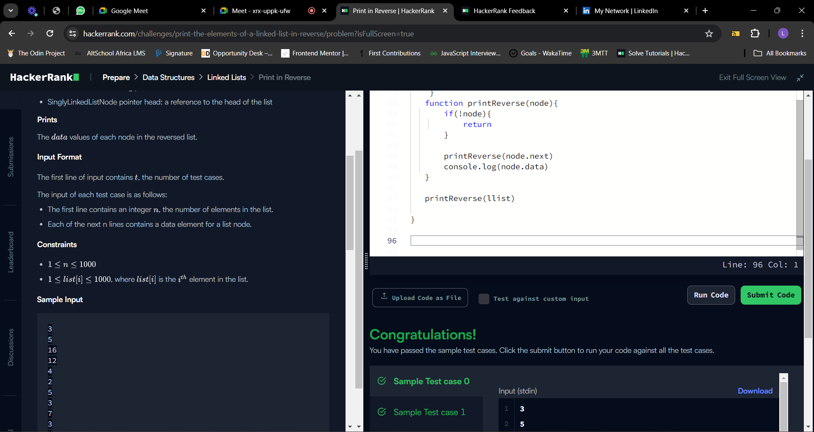
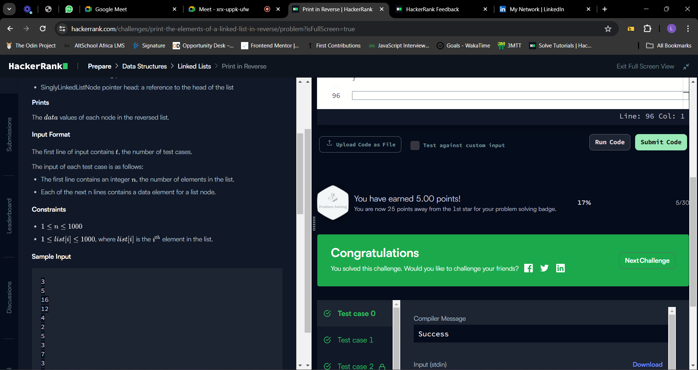
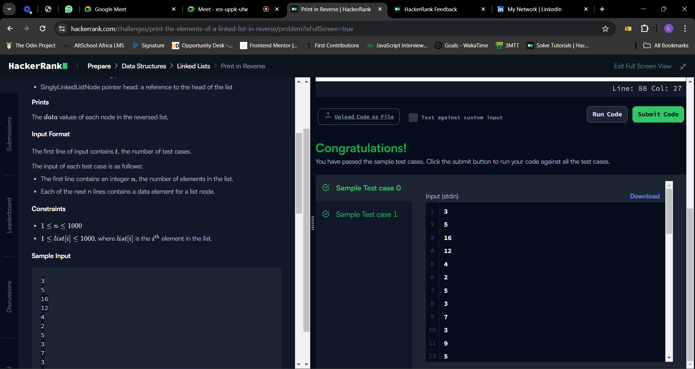

## Table of contents
- [The challenge](#the-challenge)
- [Solution](#the-solution)
- [Screenshots](#screenshot)
- [What I am Proud of](#what-I-am-proud-of)
- [Get in Touch](#get-in-touch)

## The challenge

Given a pointer to the head of a singly-linked list, print each  value from the reversed list. If the given list is empty, do not print anything.
Example
 refers to the linked list with  values 
Print the following:
3
2
1
Function Description
Complete the reversePrint function in the editor below.
reversePrint has the following parameters:
SinglyLinkedListNode pointer head: a reference to the head of the list
Prints
The  values of each node in the reversed list.
Input Format
The first line of input contains , the number of test cases.
The input of each test case is as follows:
The first line contains an integer , the number of elements in the list.
Each of the next n lines contains a data element for a list node.

## Solution

The below solution provides a function reversePrint to print the values of each node from a singly-linked list in reverse order. If the list is empty, nothing is printed. 

The reversePrint function calls a recursive helper function printReverse to iterate the linked list in a recursive manner. Each node's value is printed before recursively calling the function with the next node.

reversePrint(llist): The main function that takes the head of the linked list as input and initiates the recursive printing process.

printReverse(node): The recursive helper function that prints the value of each node in reverse order

```
function reversePrint(llist) {
    if (!llist) {
        return;
    }

    function printReverse(node) {
        if (!node) {
            return;
        }

        console.log(node.data);
        printReverse(node.next);
    }

    printReverse(llist);
}


```

## Screenshot






## What I am proud of

Today is my first day of solving dsa and I recognize that mastering DSA requires dedication, practice, and a willingness to embrace failure as a stepping stone to success. I am super glad I took the step


## Get in Touch

You can reach out to me;
 - Linkedin- [Morufat-Lamidi](linkedin.com/in/morufat-lamidi/)
 - Frontend Mentor - [@Ehmkayel](https://www.frontendmentor.io/profile/Ehmkayel)
 - Twitter - [@kamalehmk](https://www.twitter.com/kamalehmk)
 - Gmail- [Mail](lamidimorufat0@gmail.com);

