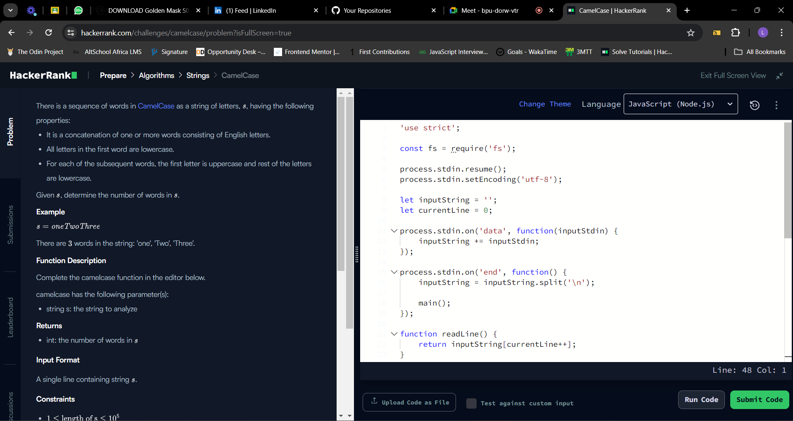
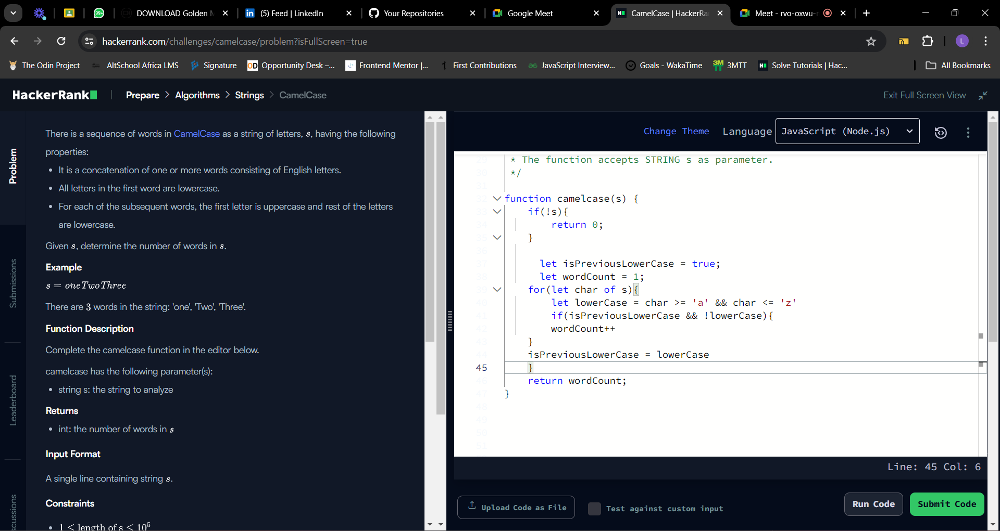
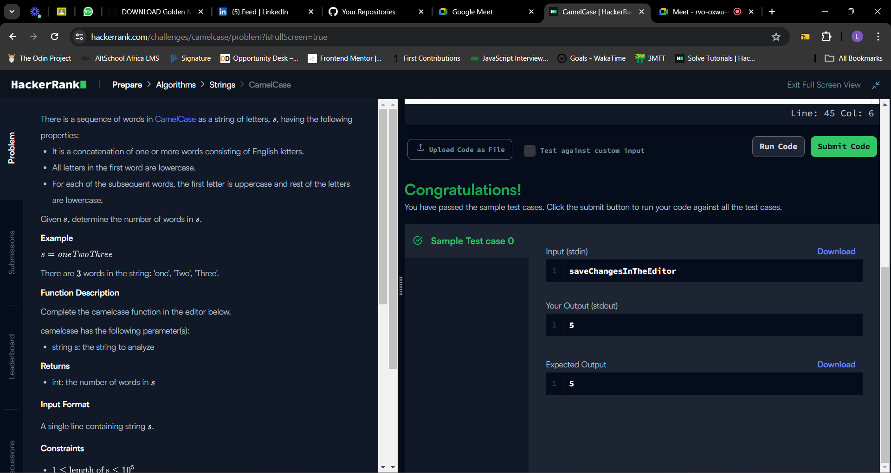

## Table of contents
- [The challenge](#the-challenge)
- [Solution](#the-solution)
- [Screenshots](#screenshot)
- [What I am Proud of](#what-I-am-proud-of)
- [Get in Touch](#get-in-touch)

## The challenge

There is a sequence of words in CamelCase as a string of letters, , having the following properties:

It is a concatenation of one or more words consisting of English letters.
All letters in the first word are lowercase.
For each of the subsequent words, the first letter is uppercase and rest of the letters are lowercase.
Given , determine the number of words in .

Example

There are  words in the string: 'one', 'Two', 'Three'.

Function Description

Complete the camelcase function in the editor below.

camelcase has the following parameter(s):

string s: the string to analyze
Returns

int: the number of words in 
Input Format

A single line containing string .

Constraints

## Solution

Functionality:

This function aims to count the number of words in a camel case string. A camel case string is where words are combined without spaces, and the first letter of each word is uppercase except for the first word.

Explanation:

if Statement (Early Return):

Checks if the input string s is empty (!s).
If it's empty, the function immediately returns 0, indicating there are no words.
Variable Initialization:

isPreviousLowerCase is initialized to true. This variable keeps track of whether the previous character encountered in the loop was lowercase. We start assuming the first character might be lowercase.
wordCount is initialized to 1. This assumes that even a single lowercase character represents a word (e.g., "a").
Looping through the String:

A for...of loop iterates through each character (char) in the string s.
Checking for Lowercase:

Inside the loop, a variable lowerCase is declared using a boolean expression to check if the current character is lowercase. It uses the ASCII character codes where lowercase letters fall between 'a' and 'z'.
Word Count Increment:

An if statement checks two conditions:
isPreviousLowerCase: This checks if the previous character was lowercase.
!lowerCase: This checks if the current character is not lowercase (uppercase).
If both conditions are met, it means we transitioned from a lowercase character to an uppercase character, potentially indicating a new word. In that case, wordCount is incremented.
Updating isPreviousLowerCase:

After checking the conditions, the isPreviousLowerCase variable is updated with the current character's lowercase status (lowerCase) for the next iteration of the loop.
Return Statement:

After the loop finishes iterating through all characters, the function returns the final value of wordCount, which represents the number of words found in the camel case string.

## Screenshot

## What I am proud of

 I learned about ASCII (American Standard Code for Information Interchange) and its significance in coding. ASCII codes represent text and symbols using numerical values, enabling computers to understand and process human-readable text.

## Get in Touch

You can reach out to me;
 - Linkedin- [Morufat-Lamidi](https://linkedin.com/in/morufat-lamidi)
 - Frontend Mentor - [@Ehmkayel](https://www.frontendmentor.io/profile/Ehmkayel)
 - Twitter - [@kamalehmk](https://www.twitter.com/kamalehmk)
 - Gmail- [Mail](mailto:lamidimorufat0@gmail.com);

