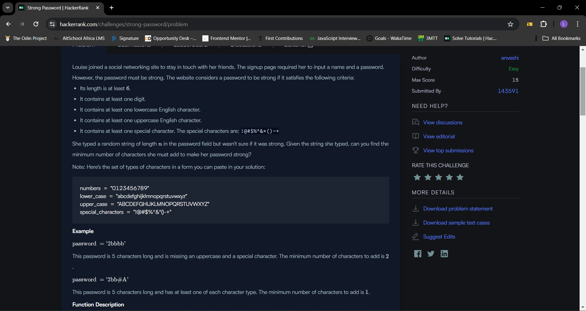
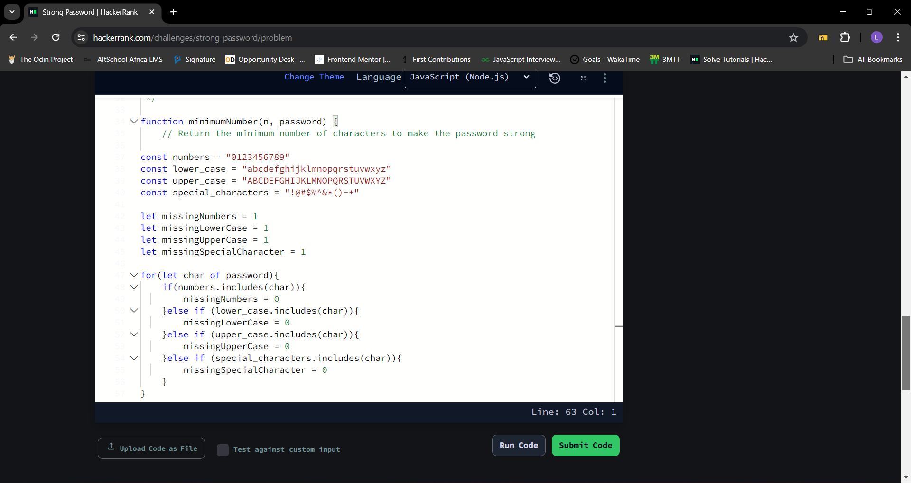

## Day 26 of #100DaysOfCode

Today, I decided to work on my problem solving skills by tackling a challenge on [Hackerank](https://www.hackerrank.com/), It was not easy but I am glad I was able to solve it


## Table of contents
- [The challenge](#the-challenge)
- [Solution](#the-solution)
- [Screenshots](#screenshot)
- [What I am Proud of](#what-I-am-proud-of)
- [Get in Touch](#get-in-touch)

## The challenge

Louise joined a social networking site to stay in touch with her friends. The signup page required her to input a name and a password. However, the password must be strong. The website considers a password to be strong if it satisfies the following criteria:

Its length is at least .
It contains at least one digit.
It contains at least one lowercase English character.
It contains at least one uppercase English character.
It contains at least one special character. The special characters are: !@#$%^&*()-+
She typed a random string of length  in the password field but wasn't sure if it was strong. Given the string she typed, can you find the minimum number of characters she must add to make her password strong?

Note: Here's the set of types of characters in a form you can paste in your solution:

```
numbers = "0123456789"
lower_case = "abcdefghijklmnopqrstuvwxyz"
upper_case = "ABCDEFGHIJKLMNOPQRSTUVWXYZ"
special_characters = "!@#$%^&*()-+"

```


## Solution

This JavaScript function calculates the minimum number of characters needed to make a password strong. A strong password must meet the following criteria:

- At least 6 characters long
- Contains at least one number
- Contains at least one lowercase letter
- Contains at least one uppercase letter
- Contains at least one special character

```
   function minimumNumber(n, password) {
    // Return the minimum number of characters to make the password strong
    
const numbers = "0123456789"
const lower_case = "abcdefghijklmnopqrstuvwxyz"
const upper_case = "ABCDEFGHIJKLMNOPQRSTUVWXYZ"
const special_characters = "!@#$%^&*()-+"

let missingNumbers = 1
let missingLowerCase = 1
let missingUpperCase = 1
let missingSpecialCharacter = 1

for(let char of password){
    if(numbers.includes(char)){
        missingNumbers = 0
    }else if (lower_case.includes(char)){
        missingLowerCase = 0
    }else if (upper_case.includes(char)){
        missingUpperCase = 0
    }else if (special_characters.includes(char)){
        missingSpecialCharacter = 0
    }
}

const missingChars = Math.max(missingNumbers + missingLowerCase + missingUpperCase + missingSpecialCharacter)
const requiredLength = Math.max(6 - n, 0); 
return Math.max(requiredLength, missingChars);

}

```


## Screenshot





## What I am proud of

 Today I earned my first star on [Hackerank](https://www.hackerrank.com/). The problem solving star and I am super proud of myself

## Get in Touch

You can reach out to me;
 - Linkedin- [Morufat-Lamidi](https://linkedin.com/in/morufat-lamidi)
 - Frontend Mentor - [@Ehmkayel](https://www.frontendmentor.io/profile/Ehmkayel)
 - Twitter - [@kamalehmk](https://www.twitter.com/kamalehmk)
 - Gmail- [Mail](mailto:lamidimorufat0@gmail.com);

