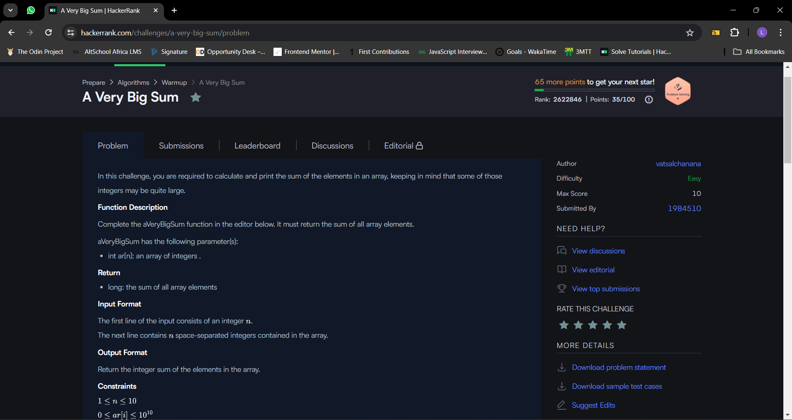
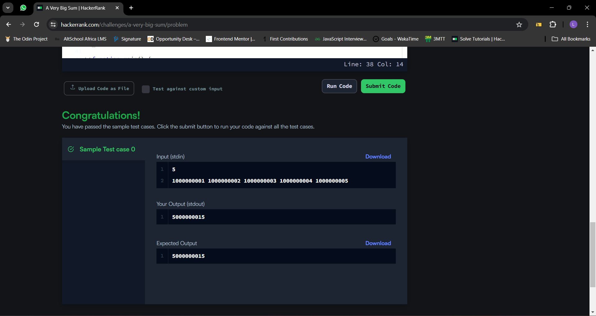

## Today, I decided to work on my problem solving skills by tackling a challenge on [Hackerank](https://www.hackerrank.com/), It was not easy but I am glad I was able to solve it

## Table of contents
- [The challenge](#the-challenge)
- [Solution](#the-solution)
- [Screenshots](#screenshot)
- [What I am Proud of](#what-I-am-proud-of)
- [Get in Touch](#get-in-touch)

## The challenge

In this challenge, you are required to calculate and print the sum of the elements in an array, keeping in mind that some of those integers may be quite large.

Function Description

Complete the aVeryBigSum function in the editor below. It must return the sum of all array elements.

aVeryBigSum has the following parameter(s):

int ar[n]: an array of integers .
Return

long: the sum of all array elements
Input Format

The first line of the input consists of an integer .
The next line contains  space-separated integers contained in the array.

Output Format

Return the integer sum of the elements in the array.

Constraints

Sample Input

5
1000000001 1000000002 1000000003 1000000004 1000000005
Output

5000000015
Note:

The range of the 32-bit integer is .
When we add several integer values, the resulting sum might exceed the above range. You might need to use long int C/C++/Java to store such sums.

## Solution

I followed the steps below while solving;

let sum = 0;: I initializes a variable sum with a value of 0 inside the function. This variable will be used to store the sum of all the elements in the array.

Then I created a for loop that iterates over each element of the array ar. It starts with i set to 0 and continues until i is less than the length of the array ar. i++ increments the value of i by 1 in each iteration.

I added the value of the current element of the array (ar[i]) to the sum variable. In each iteration of the loop, it adds the current element to the running total.

Then I return the sum of all the elements in the array.

So, when you call aVeryBigSum with an array as an argument, it will iterate over each element of that array, adding them up, and finally return the total sum.

## Screenshot

## What I am proud of

Today I continued my hackerrank and I am proud of my progress so far

## Get in Touch

You can reach out to me;
 - Linkedin- [Morufat-Lamidi](https://linkedin.com/in/morufat-lamidi)
 - Frontend Mentor - [@Ehmkayel](https://www.frontendmentor.io/profile/Ehmkayel)
 - Twitter - [@kamalehmk](https://www.twitter.com/kamalehmk)
 - Gmail- [Mail](mailto:lamidimorufat0@gmail.com);

