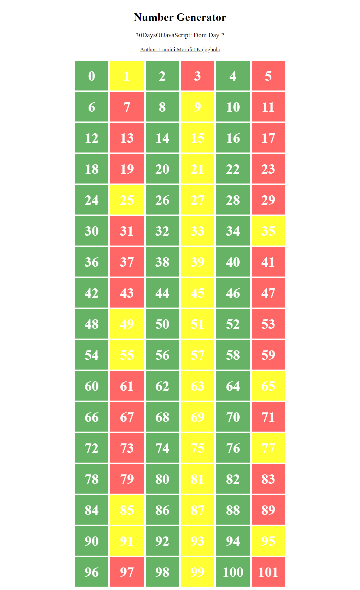

## Day 43 of #100DaysOfCode

Today, I decided to work on a mini project from the day 22 folder of Asabeneh Yetayeh [#30DaysOfJavaScript](https://github.com/Asabeneh/30-Days-Of-JavaScript/22_Day_Manipulating_DOM_object/22_day_manipulating_DOM_object.md)


## Table of contents

- [The Challenge](#the-challenge)
- [Overview](#the-overview)
- [Solution](#the-solution)
- [Features](#the-features)
- [Technologies used](#technologies-used)
- [Screenshots](#screenshot)
- [Get in Touch](#get-in-touch)


## The Challenge

1. Create a div container on HTML document and create 100 to 100 numbers dynamically and append to the container div.
  - Even numbers background is green
  - Odd numbers background is yellow
  - Prime numbers background is red

  
## Overview

This code creates a visual representation of numbers from 0 to 101, with different styles applied based on their properties (even, prime, or neither). It uses html and JavaScript achieve this.

## Solution

1. Selecting HTML elements

```JavaScript
const wrapper = document.querySelectorAll(".wrapper")
const project = document.querySelector('h3')
const author = document.querySelector('h4')
const bottom = document.querySelector('.bottom')

```
These lines select various HTML elements using their class names or tag names, I would have used `document.getElementsByClassName` or `document.getElementsByTagName` but they would return a HTMLCollection, which is a live collection that updates automatically when the document changes. While this might seem convenient, it means I can't use array methods like forEach and map directly on the collection. By using document.querySelectorAll instead, I can work with a NodeList that can be easily converted to an array, making my code more flexible and efficient.


2. Applying styles

```JavaScript
  wrapper.forEach((content, i) => {
  content.style.display = 'flex'
  content.style.flexDirection = 'column'
  content.style.textAlign = 'center'
 })

project.style.textDecoration = 'underline'
project.style.fontWeight = 'normal'

author.style.textDecoration = 'underline'
author.style.fontWeight = 'normal'

bottom.style.display = 'flex'
bottom.style.flexWrap = 'wrap'
bottom.style.alignItems = 'center'
bottom.style.width = '60%'
bottom.style.margin = 'auto'
bottom.style.justifyContent = 'space-evenly'

```
These lines apply various styles to the selected elements using the style property.

3. Defining the isPrime function

```JavaScript

function isPrime(num) {
  if (num <= 1) {
    return false
  }
  if (num === 2) {
    return true
  }
  for (let i = 2; i <= Math.sqrt(num); i++) {
    if (num % i === 0) {
      return false
    }
  }
  return true
}

```

This function checks if a given number is prime.

4. Creating and styling the div elements

```JavaScript

let count
for (let i = 0; i < 102; i++) {
  count = document.createElement('div')
  count.style.display = 'flex'
  count.style.alignItems = 'center'
  count.style.justifyContent = 'center'
  count.style.textAlign = 'center'
  count.style.width = '15%'
  count.style.height = '80px'
  count.style.color = 'white'
  count.style.margin = '2px'
  count.style.padding = '2px'
  count.style.fontWeight = 'bold'
  count.style.fontSize = '40px'

  if (i % 2 === 0) {
    count.style.backgroundColor = 'rgba(0, 128, 0, 0.6)'
  } else if (isPrime(i)) {
    count.style.backgroundColor = 'rgba(255, 0, 0, 0.6)'
  } else {
    count.style.backgroundColor = 'rgba(255, 255, 0, 0.8)'
  }

  count.textContent = i
  bottom.appendChild(count)
}


```

This loop creates 102 div elements and appends them to the bottom container element. Each div element is styled based on its index (even, prime, or neither).

### Features

- Selects HTML elements using document.querySelectorAll and document.querySelector
- Applies styles to elements using the style property
- Defines a function isPrime to check if a number is prime
- Creates and styles 102 div elements
- Appends the div elements to a container element

### Technologies Used

- JavaScript
- HTML

### Screenshots





## Get in Touch

You can reach out to me;
 - Linkedin- [Morufat-Lamidi](https://linkedin.com/in/morufat-lamidi)
 - Frontend Mentor - [@Ehmkayel](https://www.frontendmentor.io/profile/Ehmkayel)
 - Twitter - [@kamalehmk](https://www.twitter.com/kamalehmk)
 - Gmail- [Mail](mailto:lamidimorufat0@gmail.com);


