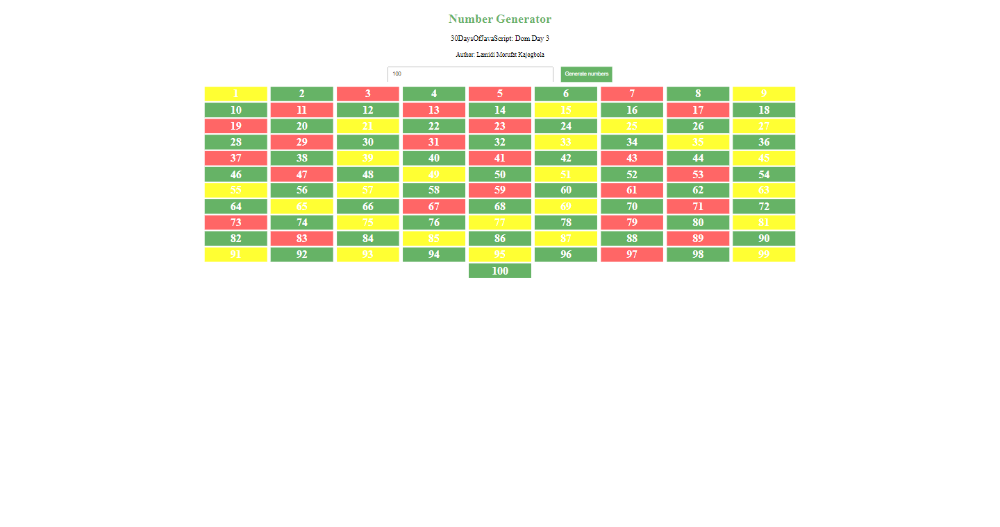
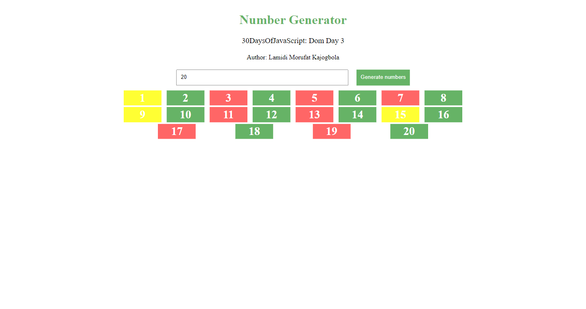
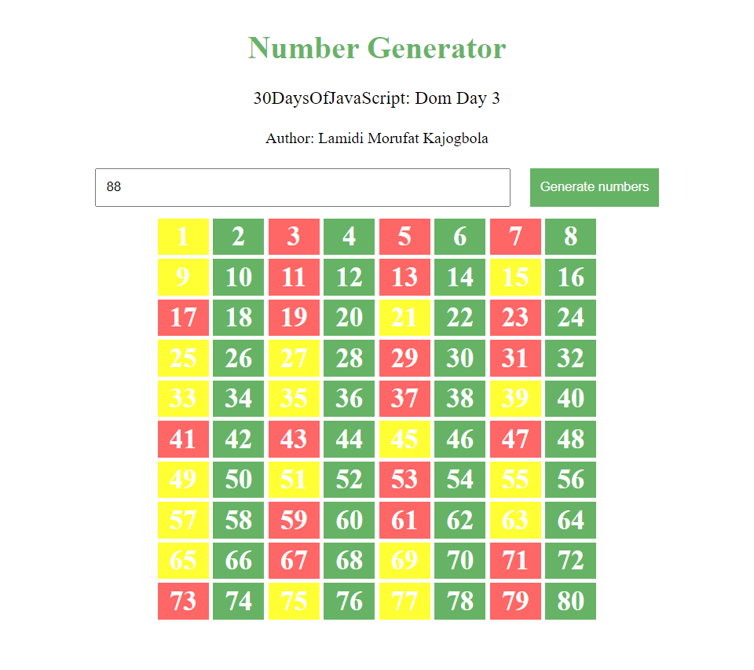
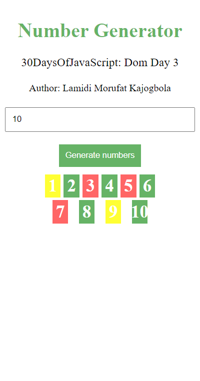

## Day 43 of #100DaysOfCode

Today, I worked on a mini project from the day 23 folder of Asabeneh Yetayeh [#30DaysOfJavaScript](https://github.com/Asabeneh/30-Days-Of-JavaScript/23_Day_Event_listeners/23_day_event_listeners.md)


## Table of contents

- [The Challenge](#the-challenge)
- [Overview](#the-overview)
- [Solution](#the-solution)
- [Features](#the-features)
- [Technologies used](#technologies-used)
- [Screenshots](#screenshot)
- [Get in Touch](#get-in-touch)


## The Challenge

1. Generating numbers and marking evens, odds and prime numbers with three different colors. 

  
## Overview

This code generates numbers based on user input with different styles applied based on their properties (even, prime, or neither). It uses html and JavaScript achieve this.

### Solution

1. Selecting HTML Elements
```JavaScript
const wrapper = document.querySelectorAll(".wrapper")
const heading = document.querySelector('h1')
const project = document.querySelectorAll('h3, h4')
const buttons = document.querySelectorAll('.buttons')
const quantityInput = document.querySelector("#quantity");
const greenButton = document.querySelector('#greenButton')
const errorMessage = document.getElementById('error');
const bottom = document.querySelector('.bottom');

```
I selected various HTML elements using `document.querySelectorAll`, `document.querySelector` and `document.getElementsById`, which return a NodeList and an Element respectively.

2. Applying Styles
```JavaScript

wrapper.forEach((content, i) => {
  content.style.display = 'flex'
  content.style.flexDirection = 'column'
  content.style.textAlign = 'center'
})
heading.style.color = 'rgba(0, 128, 0, 0.6)'
project.forEach((project) => {
  project.style.fontWeight = 'normal'
})
buttons.forEach((button) => {
  button.style.display = 'flex'
  button.style.justifyContent = 'center'
  button.style.flexWrap = 'wrap'
  button.style.gap = '20px'
})
quantityInput.style.width = '400px'
quantityInput.style.padding = '10px'
greenButton.style.backgroundColor = 'rgba(0, 128, 0, 0.6)'
greenButton.style.color = 'white'
greenButton.style.padding = '10px'
greenButton.style.border = 'none'
greenButton.style.cursor = 'pointer'
errorMessage.style.color = 'red'
errorMessage.style.fontWeight = 'bold'
errorMessage.style.marginTop = '5px'
errorMessage.style.display = 'none'
bottom.style.display = 'flex'
bottom.style.flexWrap = 'wrap'
bottom.style.alignItems = 'center'
bottom.style.width = '60%'
bottom.style.margin = '10px auto 0'
bottom.style.justifyContent = 'space-evenly'


```

I applied styles to the elements based on the project video requirements


3. Defining Functions
```JavaScript
function clearNumbers() {
  const container = document.getElementById('numberContainer')
  container.innerHTML = ''
}

```
I created a function to clear the numbers after inputting another value

```JavaScript
function generateNumbers() {
  const quantity = parseInt(quantityInput.value)
  ... (rest of the function)
}

```
I created a function to generate the numbers the user inputted

```JavaScript
function isPrime(num) {
    if (num <= 1) {
        return false;
    }
    for (let i = 2; i <= Math.sqrt(num); i++) {
        if (num % i === 0) {
            return false;
        }
    }
    return true;
}

```
I also created a function to check if the number is prime
- If `num` is less than or equal to `1`, it's not prime, so return false.
- Then I Start a loop from `2` to the square root of num.
- If `num` is divisible by any number in this range `(num % i === 0)`, it's not prime, so return false.
- If the loop completes without finding a divisor, `num is prime`, so return true.

4. Event Listeners

Then I added event listeners to the green button and quantity input.
```JavaScript
greenButton.addEventListener('click', generateNumbers);
```
When the green button is clicked, the generateNumbers function will be executed, generating the numbers and updating the display.


### Features

- Users can enter a quantity in the input field.
- Clicking the green button triggers the generation of numbered boxes.
- Even numbers are displayed in green boxes.
- Prime numbers are displayed in red boxes.
- All other numbers are displayed in yellow boxes.
- The application gracefully handles invalid user input (non-numeric or zero or negative values) by displaying an error message.

### Technologies Used

- JavaScript
- HTML

### Screenshots

- Desktop View


- Laptop View


- Tablet View


- Mobile View


## Get in Touch

You can reach out to me;
 - Linkedin- [Morufat-Lamidi](https://linkedin.com/in/morufat-lamidi)
 - Frontend Mentor - [@Ehmkayel](https://www.frontendmentor.io/profile/Ehmkayel)
 - Twitter - [@kamalehmk](https://www.twitter.com/kamalehmk)
 - Gmail- [Mail](mailto:lamidimorufat0@gmail.com);


