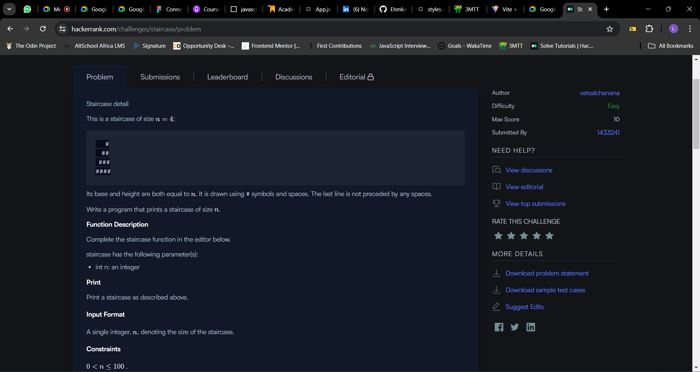
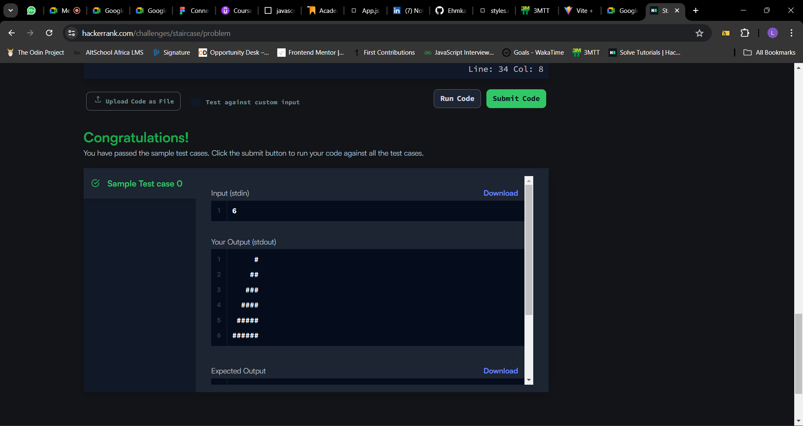

# Day 55 of #100DaysOfCode challenge

## Today, I decided to work on my problem solving skills by tackling a challenge on [Hackerank](https://www.hackerrank.com/), It was not easy but I am glad I was able to solve it

## Table of contents
- [The challenge](#the-challenge)
- [Solution](#the-solution)
- [Screenshots](#screenshot)
- [What I am Proud of](#what-I-am-proud-of)
- [Get in Touch](#get-in-touch)

## The challenge

Staircase detail

This is a staircase of size :

   #
  ##
 ###
####
Its base and height are both equal to . It is drawn using # symbols and spaces. The last line is not preceded by any spaces.

Write a program that prints a staircase of size .

Function Description

Complete the staircase function in the editor below.

staircase has the following parameter(s):

int n: an integer
Print

Print a staircase as described above.

Input Format

A single integer, , denoting the size of the staircase.

Constraints

 .

Output Format

Print a staircase of size  using # symbols and spaces.

Note: The last line must have  spaces in it.

Sample Input

6 
Sample Output

     #
    ##
   ###
  ####
 #####
######
Explanation

The staircase is right-aligned, composed of # symbols and spaces, and has a height and width of .

## Solution

I followed the steps below while solving;

1. `for(let i = 1; i <= n; i++ ):` first, I'm using a for loop to iterate from 1 to n. This will control the number of lines in my staircase.

2. `let line = '':` I initialized an empty string called line that I used to build each line of the staircase.

3.  `for(let j = 0; j < n-i; j++):` Then, I used another for loop to add spaces to the line string. This will create the indentation for each line. It will run the loop from 0 to n-i, where i is the current line number.

4. `for(let k = 0; k < i; k++):` This inner loop runs from k = 0 to k = i. It adds # characters to the line string, creating the staircase pattern.

5. `line += '#':` This adds a # character to the line string.

6. Finally, I printed the completed line string to the console using console.log.

The process can be visualized as:

- For each line (outer loop):
    - Add spaces (inner loop 1) to create indentation.
    - Add # characters (inner loop 2) to create the staircase pattern.
    - Print the completed line to the console.

This results in a staircase pattern with n lines, where each line has i # characters and n-i spaces.

## Screenshot

## What I am proud of

Today I continued my hackerrank and I am proud of my progress so far

## Get in Touch

You can reach out to me;
 - Linkedin- [Morufat-Lamidi](https://linkedin.com/in/morufat-lamidi)
 - Frontend Mentor - [@Ehmkayel](https://www.frontendmentor.io/profile/Ehmkayel)
 - Twitter - [@kamalehmk](https://www.twitter.com/kamalehmk)
 - Gmail- [Mail](mailto:lamidimorufat0@gmail.com);

