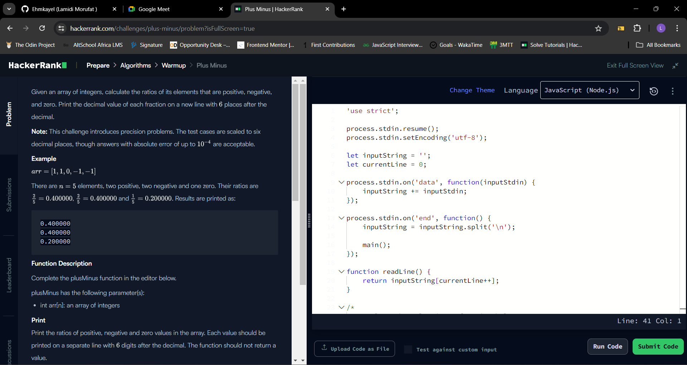

## Day 68 of #100DaysOfCode

## Table of contents
- [The challenge](#the-challenge)
- [Solution](#the-solution)
- [Screenshots](#screenshot)
- [What I am Proud of](#what-I-am-proud-of)
- [Get in Touch](#get-in-touch)

## The challenge

Given an array of integers, calculate the ratios of its elements that are positive, negative, and zero. Print the decimal value of each fraction on a new line with  places after the decimal.

Note: This challenge introduces precision problems. The test cases are scaled to six decimal places, though answers with absolute error of up to  are acceptable.

Example

There are  elements, two positive, two negative and one zero. Their ratios are ,  and . Results are printed as:

0.400000
0.400000
0.200000
Function Description

Complete the plusMinus function in the editor below.

plusMinus has the following parameter(s):

int arr[n]: an array of integers
Print
Print the ratios of positive, negative and zero values in the array. Each value should be printed on a separate line with  digits after the decimal. The function should not return a value.

Input Format

The first line contains an integer, , the size of the array.
The second line contains  space-separated integers that describe .

Constraints


Output Format

Print the following  lines, each to  decimals:

proportion of positive values
proportion of negative values
proportion of zeros

## Solution

These are the steps I follow;

- Initialize Counters: I started by initializing three variables (positiveCount, negativeCount, zeroCount) to zero. These will be used to count the number of positive, negative, and zero elements in the array.

- Iterate through the Array: Use a for loop to iterate through each element of the input array (arr).

- Count Elements: Inside the loop:

```JavaScript 

If the current element (arr[i]) is greater than 0, increment positiveCount.
else if the current element is less than 0, increment negativeCount.
else (if the current element is equal to 0), increment zeroCount.
Calculate Ratios: After iterating through the array, calculate the ratios for positive, negative, and zero numbers:

```

```JavaScript
Compute positiveRatio as positiveCount / n, where n is the total number of elements in the array.
Compute negativeRatio as negativeCount / n.
Compute zeroRatio as zeroCount / n.
Format Ratios: Use the .toFixed(6) method to format each ratio to six decimal places. This ensures consistency in the output format.


```

- Output Ratios: Then I printed the formatted ratios (positiveRatio, negativeRatio, zeroRatio) to the console.

## Screenshot




## Get in Touch

You can reach out to me;
 - Linkedin- [Morufat-Lamidi](https://linkedin.com/in/morufat-lamidi)
 - Frontend Mentor - [@Ehmkayel](https://www.frontendmentor.io/profile/Ehmkayel)
 - Twitter - [@kamalehmk](https://www.twitter.com/kamalehmk)
 - Gmail- [Mail](mailto:lamidimorufat0@gmail.com);

