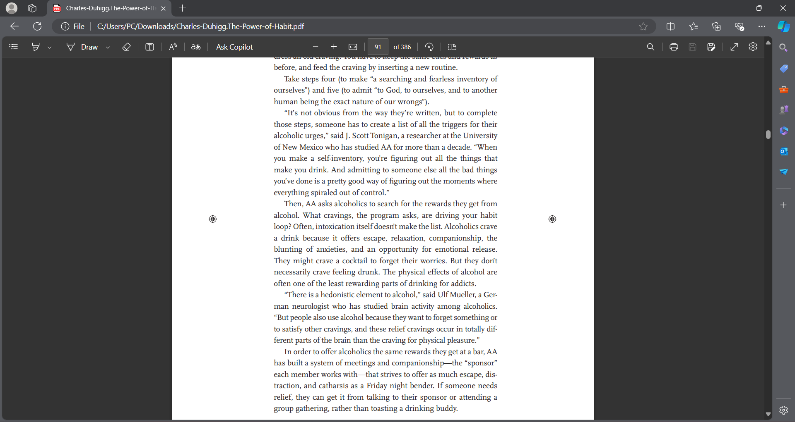
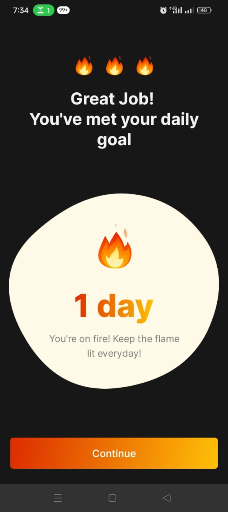
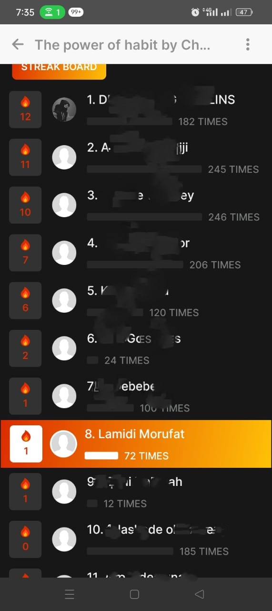

## Day 81 of #100DaysOfCode challenge update

Today was spent off coding as I caught up with my book club's pick for this month, "The Power of Habit" by Charles Duhigg. 

I loved how the author explained that habits are made up of a cue, a routine, and a reward.

Reading about the power of routines and how rewarding ourselves after reaching milestones really resonated with me, as I am a big believer of rewarding myself after each milestone.

I have not been logging my progress since I started reading the book as I started a bit late, so I had to logged my progress all at once.

